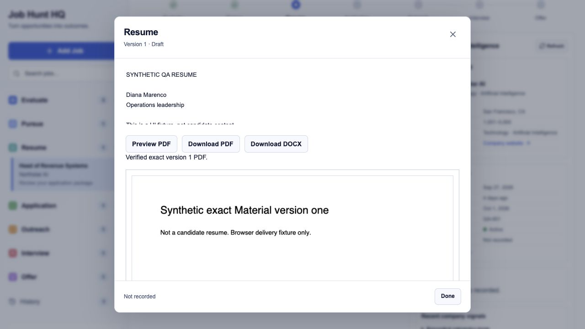
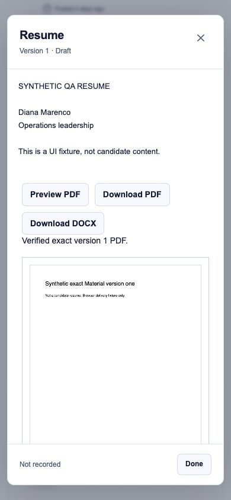
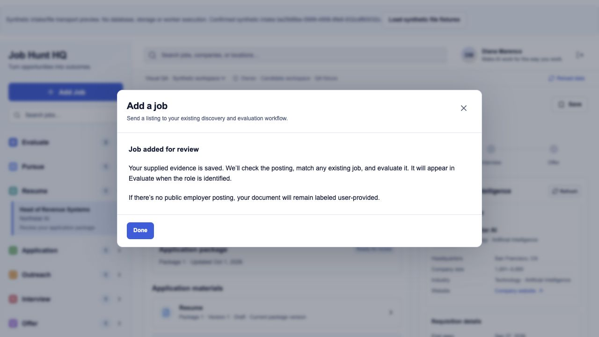
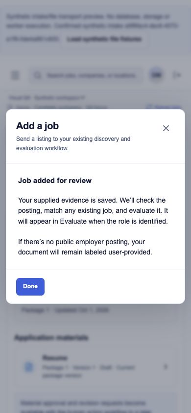

# Job Hunt HQ · intake, exact files, research request and ATS packet

Status: local review only. Branch `codex/job-hunt-hq-intake-delivery`, existing draft PR4, stacked on Phase2 and preserving the user-authored worker snapshot commit `a254eae`. Proposed migrations `20261001225212_hq_manual_intake_and_material_delivery.sql` and `20261002001252_hq_research_refresh_request.sql` are unapproved and unapplied. No production buckets, data, worker prompts or flags were changed. Exact approved Phase2 SQL remains Git blob `0ef9a55b7158d19a99cdf426a628b234191ee318`.

Proposed SQL SHA256 review pins:

- Intake/artifacts: `ad96b4e0bdbba0a8da1c12522f733e86f6f785cfe0caa60ce68c0b02545084a6` (unchanged from published PR4).
- Research refresh: `fabd61fa09abc613eb6ac0fd48c2da492fe7e1fba88a2cd4cfd8dc9e4a34b2fd` (new, separate proposal).

## Result

Diana can supply a URL, pasted job description or supported file through one human intake request. It appends unverified source evidence and queues the existing `job_alert_intake` worker once; it never creates a second evaluator or applies to a job. Uncertain retries preserve the key/evidence/upload. The worker researches and deduplicates using scoped IDs, verified listing URL and positively identified active hiring event in that order. Without a public listing, the worker retains explicitly user-provided evidence and unknown facts.

Exact immutable Material versions can have a registered private DOCX/PDF pair. The preparation worker keeps `executive-brief-two-page-v2`, converts the exact DOCX, performs visual and parse-back QA, then publishes hashes/provenance while the Material is still draft. The candidate UI verifies byte size/SHA-256 before PDF preview or either download, uses versioned filenames, and refuses missing or inconsistent pairs. Pinned PDF.js `6.3.289` renders verified in-memory bytes with a self-hosted copied worker; no persistent public/signed file URL or browser conversion. Historical Material IDs and submission snapshots remain attributable to the same immutable registrations/bytes.

The legacy `Open recorded artifact` link is removed: its stored reference remains
history, but cannot bypass exact-version registration/hash verification. Missing
pair, mismatched pair and failed hash with populated `file_url` have regressions.
Submitted history opens the exact old Material ID/Workspace/type and its own pair,
even after a newer current version exists; foreign-workspace snapshots are hidden.

Refresh is an explicit human queue request to existing research architecture. It
appends attributed provenance, freezes version/key on uncertain retry, coalesces
pending work and shows plain pending/blocked states while keeping recorded facts.
It never changes completed Evaluations, pursuit or application authority. Actual
research caller/policy/runtime/consumer adoption still needs verification.

The approved application packet presents the inspected ATS URL, exact approved
resume/cover files, skills and recorded screening/salary/work-authorization/link/
employer-specific answers through existing immutable Materials. Copy is explicit;
voluntary/sensitive answers remain the candidate's choice. Required unknown
answers/attachments disable client submission confirmation until a new reviewed
version resolves them. No automatic form filling, application submission or
extra strategy approval. Legacy text stays inspectable without an invented
structured-completeness claim. Approved Phase2 RPC authority is unchanged.

## Authority and data impact

The additive migration creates one Material child table, two private buckets, caller-invoker helpers/RPC and RLS policies. It changes no existing business permission, role grant, lifecycle value or trigger. Artifact SELECT uses `application.read`, INSERT uses `application.prepare`; authenticated UPDATE/DELETE is unavailable. The existing narrow prepare-only agent can publish without task execution, approval or submission permissions. Human intake requires existing Activity/Internal Task read/create permissions and active Workspace/human membership. Existing discovery identity reads referenced uploads under Workspace Activity authority.

Buckets: `hq-intake` maximum 8 MB (PDF, DOCX, PNG, JPEG, text); `hq-materials` maximum 16 MB (PDF/DOCX). Exact hashed object paths bind their Workspace and actor/request or Material. Restrictive guards constrain preexisting broad permissive Storage policies for these new buckets and forbid authenticated/anonymous overwrites/deletes. Other buckets are unchanged. No backfill or historical deletion. Orphan evidence/uploads can remain after cancellation/failure; there is no automatic destructive cleanup. Storage usage/cost increases only when the approved workflow actually uploads files.

Artifact QA is a trusted preparation-worker attestation bound to exact hashes, not independent SQL proof that content was visually inspected. The helper validates provenance and emits registration rows; it does not render, convert, QA, upload or approve. DOCX file signatures establish a container only; the worker must safely validate/extract untrusted uploads with decompression limits. No service/admin credential bypass is allowed.

See [design/schema contract](../docs/03-design/hq-intake-material-delivery.md), [intake worker skill](../skills/job-alert-intake/SKILL.md) and [preparation publication contract](../skills/prepare-application/SKILL.md). These are proposed repository contracts, not evidence of adoption by an actual hosted task. CLI helpers are optional where the repository/Node runtime is verified; hosted prompt changes must state the same invariants self-contained and preserve existing instructions.

The second proposed migration adds only `hq_request_research_refresh`, with
existing active-human Opportunity/Intelligence/Activity/Task authority and
actor/request plus Workspace/Opportunity advisory serialization. It appends an
event once and creates/reuses the existing-domain task without Activity/Task
UPDATE permissions, new business permission/role grants, business values or fact mutations. Its
separate [research handoff](../skills/refresh-company-intelligence/SKILL.md) is
proposed, not an adopted hosted consumer. No new answer table is introduced.

## Validation

- Automated suite: **195 tests in15 files pass**, covering research SQL/RLS, unchanged completed Evaluation snapshots, retry/double-click/task completion, default-off/individual-on/all-on transport matrix, approved packet/required unknown fields, copy errors, legacy bypass and exact old submitted-version selection, alongside all previous intake/delivery/Phase2 cases.
- Native PostgreSQL17.6: nine overlapping two-connection checks passed with actual lock waits. Two research cases cover identical-key replay and distinct requests coalescing to one task, with exact completed Evaluation/Opportunity preservation. Identical intake retries produce one event/task; conflicting same-key evidence is rejected. Existing Pursue, competing decisions, revision, approval and submission races still pass. Replayed actual baseline and proposed migrations, skipped only two production identity provisions; Storage catalog interface is a local test mock. Owned private Unix-socket cluster, TCP disabled, no production credentials; stopped/removed after verification.
- Typecheck, lint, formatting and optimized Next.js build pass. Generated pinned PDF worker is ignored by format/lint and recreated by predev/prebuild, not maintained as source.
- Synthetic desktop and 390×844 mobile browser QA: intake success/retry and pasted-description confirmation; two PDF pages render, extracted text includes both pages, controls and Done remain accessible, document width equals viewport. Screenshots below. These fixtures contain no candidate document or real employer content and execute no database, Storage or worker request.
- Browser download-event capture timed out; no OS-saved PDF/DOCX was verified. Browser file-picker check was interrupted. Automated tests verify exact delivery bytes, download filenames, attached download anchors and URL cleanup; actual browser file selection/download acceptance remains pending.
- Production loopback preview: `/qa?intake=1&delivery=1` returns 404 even with fixtures flag set; `/api/public-config` returns 503 with missing connection configuration. Both owned preview processes are stopped.
- Final follow-up production loopback check also returns404 for `/qa?job=application&actions=1&packet=1&delivery=1&refresh=1` with fixtures flag set, and503 for missing public config. All mutation flags were off and public connection values empty; owned server stopped. Typecheck, lint, format and optimized build pass at this final local checkpoint.

Canonical **synthetic** DOCX→PDF was executed with unchanged renderer and fictional
Casey Example. [DOCX](qa-evidence/canonical/resume-v1.docx),
[PDF](qa-evidence/canonical/resume-v1.pdf), both inspected PNG pages, extracted
text, exact input/provenance and [QA report](qa-evidence/canonical/report.json)
are committed. Exactly two pages, every input fact retained, no out-of-page text,
no visual clipping/overlap; Page1 positioning and Page2 experience. The actual
bytes pass both-format SDK/hash/version tests with mocked HTTP. Repeatable
read-only [verifier](scripts/verify-canonical-qa.py) checks hashes, all supplied
text and page geometry; it does not replace human visual inspection.

**Converter-runtime limit:** official LibreOffice26.8.0 DMG checksum matched, but
its copied bundle failed strict signature validation. One isolated headless
conversion ran before that result was noticed; no signature/security bypass,
global install or user-profile changes. Further copied-runtime execution stopped.
Validated converter-runtime acceptance remains pending. See the full
[canonical evidence/limitations](qa-evidence/canonical/README.md).

Earlier browser fixtures remain hand-authored transport files, not these canonical
documents. Current tools expose no browser controller; new packet/research
browser layout and OS-saved upload/download acceptance remain unverified.
Synthetic DOM/SDK checks and local files do not certify real Storage API,
hosted worker adoption or real candidate/employer acceptance.

| Desktop                                                          | Mobile                                                       |
| ---------------------------------------------------------------- | ------------------------------------------------------------ |
|            |  |
|  |  |

## Approval, deployment and rollback

1. Review both exact new migrations separately under Master Build Brief §23. Earlier Phase2 approval covers neither the buckets/artifact policies nor the research-request RPC. No apply/activation is requested implicitly by this draft.
2. Before apply, fresh read-only inventory must verify project identity, migration history, Material/helpers/permissions, actual Storage catalog/API metadata behavior, all object policies, bucket-name absence and private limits. Bucket collisions fail rather than silently reusing them. Recheck live schema drift and dependencies; use the approved exact SQL through the normal migration process.
3. Identify and review actual hosted Job Alert Intake, Application Queue and Owner/research consumer instructions/callers/policies/runtime, preserve their existing workflow, install minimal approved additive contracts and read them back. A user-provided snapshot is useful evidence but is not independent live readback. Do not assume CLI availability or replace prompts blindly.
4. Verify real Storage upload/read/RLS and canonical renderer publication through an explicitly authorized isolated non-production fixture strategy. Include real human/preparer/discovery/foreign/anonymous boundaries, no upsert/delete, exact hashes, readiness failure, retries, submitted historical files, and actual browser PDF/DOCX selection/download. No production job/application/test rows are authorized by this review.
5. Keep `HQ_MANUAL_INTAKE`, `HQ_MATERIAL_DELIVERY` and `HQ_RESEARCH_REFRESH` off until separate explicit activation approval plus verified deployed schema, Storage and worker adoption. `HQ_HUMAN_ACTIONS` remains independently gated. Hosted HQ deployment location/flag state has not been certified. Final isolated domain integration must follow [the shared API contract](INTEGRATION_CONTRACT.md) and combine all capabilities/context/reset/QA paths rather than pick one conflicted owner file.

Rollback: disable the affected intake/delivery capabilities, preserve events/tasks, historical registrations and private bytes, and keep buckets private. Already-queued worker tasks need coordinated handling; flag rollback does not erase them. No drop/delete or history rewrite. If later function/policy removal is necessary, propose a forward migration after dependency review. Reverting the UI does not grant broad Storage access or change existing worker permissions.

## Master Build Brief §26 · full Definition of Done checkpoint

| Item                                  | Evidence and remaining gate                                                                                                                                                             |
| ------------------------------------- | --------------------------------------------------------------------------------------------------------------------------------------------------------------------------------------- |
| 1. Sign in as Diana                   | Real Phase 1 sign-in accepted by Diana.                                                                                                                                                 |
| 2. Active jobs by stage               | Real stage organization accepted; preserve seven derived stages.                                                                                                                        |
| 3. Coherent role workspace            | Core tabs/navigation accepted; later domains extend the same view.                                                                                                                      |
| 4. Candidate Fit and Opportunity Fit  | Real separate scores accepted; no score authorizes pursuit.                                                                                                                             |
| 5. Research and freshness             | Local explicit refresh request/queue/UI/RLS/retry/concurrency complete; actual research consumer/policy/runtime/adoption/activation gate remains. Richer signals deferred non-blocking. |
| 6. Pursue, Pass, Defer                | Phase 2 local RPC/UI/RLS/retry/concurrency pass; exact approved production migration and hosted worker adoption/activation remain coordinated gates.                                    |
| 7. Review generated materials         | Version/text viewers exist; actual hosted generation-to-review handoff still needs safe validation.                                                                                     |
| 8. Exact resume/cover-letter PDF/DOCX | Local pair delivery and real canonical synthetic DOCX→PDF/visual/parse/hash proof complete; validated converter runtime, hosted publication, real Storage and browser saves remain.     |
| 9. Approve package                    | Exact Material approval verified locally; hosted Phase 2 rollout pending.                                                                                                               |
| 10. Employer ATS with answers/files   | Local approved packet/inspected ATS/confirmed field Copy/required-input guards complete; actual form-inspection worker contract adoption and supported browser acceptance remain.       |
| 11. Record submission                 | Local explicit confirmation/attribution/retry/concurrency pass; hosted validation pending, no real submission authorized.                                                               |
| 12. Exact employer-received materials | Local exact old Material ID/pair selection after newer versions and foreign-snapshot denial pass; real historical Storage/browser acceptance and final stack remain.                    |
| 13. Outreach contacts                 | Separately assigned Outreach implementation; consolidated domain approval/rollout remains.                                                                                              |
| 14. Exact outreach and sent state     | Same separate Outreach work; explicit human sent-state and external-action gates preserved.                                                                                             |
| 15. Interview preparation             | Separately assigned structured Interview work; domain approval/rollout remains.                                                                                                         |
| 16. Offer review                      | Separately assigned structured Offer work; domain approval/rollout remains.                                                                                                             |
| 17. URL/JD/upload intake              | All three local paths and existing-worker contract implemented; actual worker adoption, safe extractor, Storage API and live acceptance remain.                                         |
| 18. Clear next steps                  | Candidate workspace accepted; new plain intake progress/block states hide raw machine output.                                                                                           |

V1 is not declared complete. Phase 7 still needs the integrated safe end-to-end pass through discovery, evaluation, pursuit, generation/review/approval, submission/history, Outreach, Interview and Offer, including closed/history and desktop/mobile behavior. Business-problem wording and richer company signals remain deferred non-blocking improvements; they were not started here.
